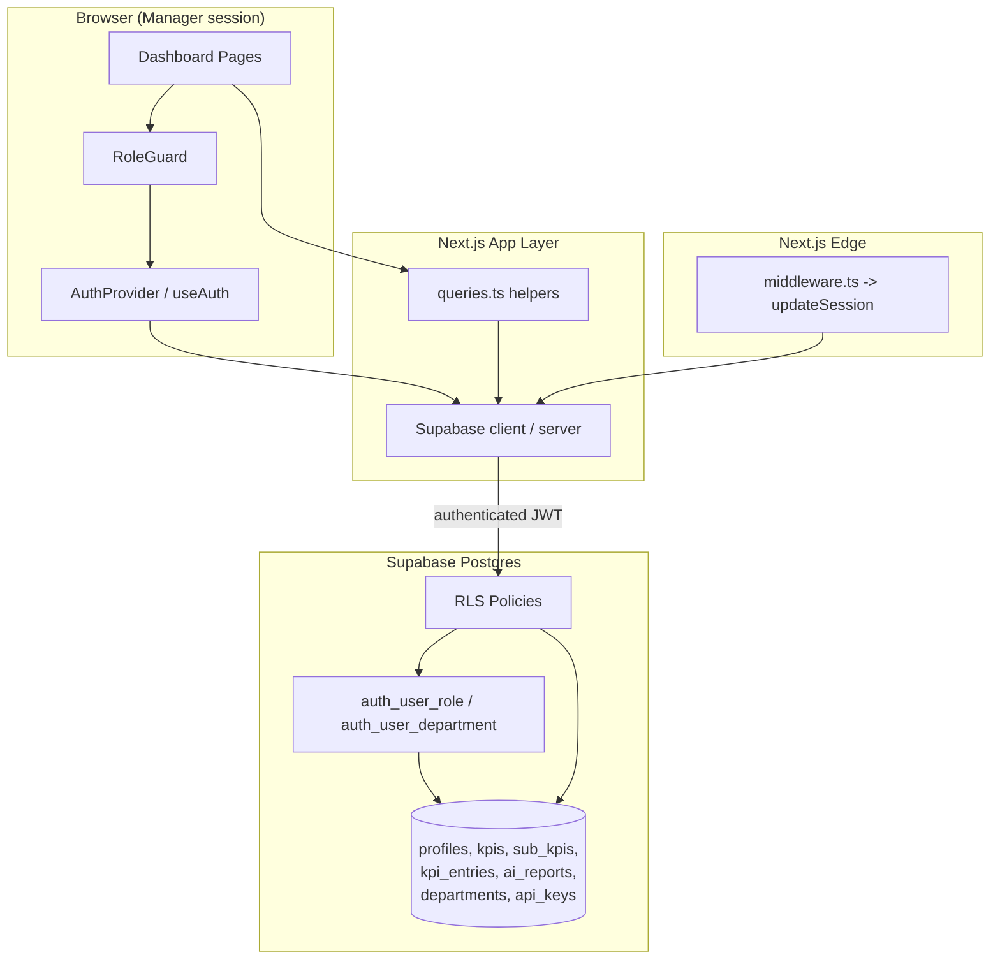
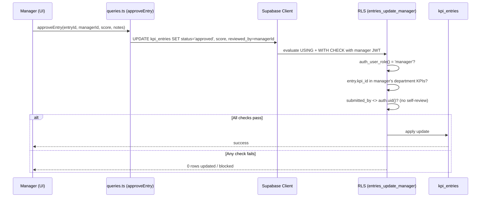
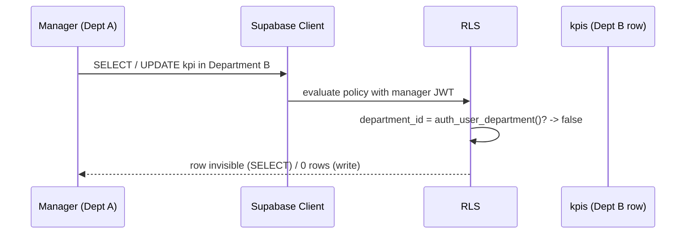

# Design Document: Manager RBAC

## Overview

Manager RBAC formalizes the access control model for the `manager` role in the KPI Monitoring System. A manager is a department-scoped authority: they can fully manage the KPIs, sub-KPIs, and team within their own department, review and score the KPI entries their staff submit, and read department-scoped AI reports. They cannot reach data outside their department, cannot perform org-wide administration (departments, users across departments, API keys), and cannot approve or score entries they themselves submitted.

This design unifies enforcement across two layers that already exist in the codebase. The database layer (Supabase Postgres + Row-Level Security) is the source of truth and the last line of defense: every access decision a manager makes is ultimately re-validated by an RLS policy keyed on `auth_user_role()` and `auth_user_department()`. The application layer (Next.js middleware, `AuthProvider`, `RoleGuard`, and shared query helpers) provides routing, navigation, and UX gating so managers only see what they are allowed to act on. The application layer is a convenience and must never be trusted alone; RLS guarantees correctness even if the UI is bypassed.

The feature is primarily a consolidation and hardening effort rather than a green-field build. The existing schema already encodes most manager-scoped policies, but with two notable gaps this design closes: (1) the manager `UPDATE` policy on `kpi_entries` lacks a `WITH CHECK` clause, allowing a manager to potentially move an entry to a KPI outside their department, and (2) there is no rule preventing a manager from approving or scoring their own submitted entry (self-review). The design defines the complete, correct policy set and the application contract around it.

## Architecture



The request path: `middleware.ts` refreshes the Supabase session and redirects unauthenticated users away from `/dashboard`. Client components read the current profile through `AuthProvider`, which exposes `isManager`. `RoleGuard` gates page rendering by role. All data operations flow through the Supabase client carrying the user's JWT, and every query/mutation is filtered server-side by RLS policies that resolve the caller's role and department via the `SECURITY DEFINER` helper functions.

## Sequence Diagrams

### Manager reviews and approves a department entry



### Manager attempts cross-department access (denied)



## Manager Permission Matrix

This is the authoritative specification of what a `manager` may do. "Dept" means the resource belongs to the manager's own `department_id`.

| Resource | Action | Allowed for manager? | Scope / Condition |
|----------|--------|----------------------|-------------------|
| profiles | SELECT | Yes | Own profile + profiles where `department_id = own dept` |
| profiles | INSERT/UPDATE/DELETE | No | Admin only (managers cannot change roles or move users) |
| departments | SELECT | Yes | All departments (read-only) |
| departments | INSERT/UPDATE/DELETE | No | Admin only |
| kpis | SELECT | Yes | Active KPIs (all) + own-dept KPIs |
| kpis | INSERT/UPDATE/DELETE | Yes | Only where `department_id = own dept` |
| sub_kpis | SELECT | Yes | All sub-KPIs |
| sub_kpis | INSERT/UPDATE/DELETE | Yes | Only where parent KPI's `department_id = own dept` |
| kpi_entries | SELECT | Yes | Entries whose KPI is in own dept (+ own submissions) |
| kpi_entries | UPDATE (approve/reject/score) | Yes | Own-dept entries, **except entries they submitted** |
| kpi_entries | INSERT | Yes (as submitter) | Only `submitted_by = self` (acts as staff for own entries) |
| kpi_entries | DELETE | No | Admin only |
| ai_reports | SELECT | Yes | `department_id = own dept` OR `department_id IS NULL` |
| ai_reports | INSERT/UPDATE/DELETE | No | Service role / admin only |
| api_keys | ALL | No | Admin only |

### Key Invariants

- **Department isolation**: A manager can never read or write a department-scoped resource outside their own `department_id`.
- **No self-review**: A manager cannot approve, reject, or score a `kpi_entry` where `submitted_by = auth.uid()`.
- **No KPI reassignment escape**: An `UPDATE` on `kpi_entries` cannot move the entry to a `kpi_id` outside the manager's department (enforced by `WITH CHECK`).
- **No privilege escalation**: A manager cannot change any profile's `role` or `department_id`, nor manage org-wide entities.
- **Read-write asymmetry on KPIs**: Managers may read all active KPIs (for cross-department visibility/benchmarking) but may only mutate their own department's KPIs.

## Components and Interfaces

### Component 1: RLS Policy Set (database)

**Purpose**: The authoritative enforcement of the permission matrix. Implemented as Postgres RLS policies using `SECURITY DEFINER` helpers to avoid recursive policy evaluation on `profiles`.

**Interface** (SQL helper contract):
```sql
auth_user_role() RETURNS text        -- current user's role, bypassing RLS
auth_user_department() RETURNS uuid   -- current user's department_id, bypassing RLS
```

**Responsibilities**:
- Resolve caller identity (role, department) safely.
- Filter every SELECT and gate every write per the permission matrix.
- Enforce department isolation, no-self-review, and no-reassignment invariants.

### Component 2: `RoleGuard` (application)

**Purpose**: Client-side page gate that prevents managers from rendering admin-only pages and redirects them to `/dashboard`.

**Interface**:
```typescript
interface RoleGuardProps {
  children: React.ReactNode;
  allowed: Array<"admin" | "manager" | "staff">;
}
```

**Responsibilities**:
- Render children only when `user.role ∈ allowed`.
- Redirect otherwise. UX-only; not a security boundary.

### Component 3: `AuthProvider` / `useAuth` (application)

**Purpose**: Loads the current profile and exposes role flags consumed by navigation and guards.

**Interface**:
```typescript
interface AuthContextType {
  user: UserProfile | null;
  loading: boolean;
  isAdmin: boolean;
  isManager: boolean;
  isStaff: boolean;
  logout: () => Promise<void>;
}
```

**Responsibilities**:
- Provide `isManager` and the manager's `department_id` for scoping UI queries.
- Never used as the sole authorization check.

### Component 4: Query Helpers (`queries.ts`)

**Purpose**: Shared data-access functions used by manager-facing pages (team, entries review, KPI management).

**Interface** (manager-relevant subset):
```typescript
fetchPendingEntries(supabase, departmentId?): Promise<...>     // review queue
approveEntry(supabase, entryId, reviewerId, score?, notes?)    // approve + score
rejectEntry(supabase, entryId, reviewerId, notes?)             // reject
updateEntryDecision(supabase, entryId, reviewerId, status, opts?) // amend decision
fetchTeamMembers(supabase, departmentId?): Promise<...>        // team roster
fetchKpis(supabase, departmentId?): Promise<...>               // dept KPIs
```

**Responsibilities**:
- Pass `departmentId` to pre-scope queries for UX, knowing RLS will re-enforce scope regardless.

## Data Models

No new tables are introduced. Manager RBAC operates on the existing schema. The fields material to authorization decisions are:

### profiles
```typescript
interface Profile {
  id: string;            // = auth.users.id
  full_name: string;
  email: string;
  role: "admin" | "manager" | "staff";  // authorization principal
  department_id: string | null;          // scoping key
  is_active: boolean;
}
```
**Validation rules (RBAC-relevant)**:
- A manager's `department_id` SHOULD be non-null; a manager with null department has no department-scoped access (degrades safely to own-profile-only).
- Only admins may change `role` or `department_id`.

### kpi_entries
```typescript
interface KpiEntry {
  id: string;
  kpi_id: string;                 // links to department via kpis.department_id
  submitted_by: string;           // submitter; basis for no-self-review rule
  status: "pending" | "approved" | "rejected";
  reviewed_by: string | null;     // set to manager on decision
  reviewed_at: string | null;
  review_notes: string | null;
  score: number | null;           // 0–100, set by reviewer on approval
}
```
**Validation rules (RBAC-relevant)**:
- `score` must be null or within `[0, 100]` (existing CHECK constraint).
- A manager decision sets `reviewed_by = auth.uid()` and requires `submitted_by <> auth.uid()`.
- `kpi_id` on update must remain within the manager's department.

## Algorithmic Pseudocode

### Manager entry-decision authorization

```pascal
ALGORITHM authorizeManagerEntryUpdate(entry, newRow)
INPUT: entry (existing kpi_entries row), newRow (proposed values)
OUTPUT: allowed (boolean)

BEGIN
  IF auth_user_role() <> 'manager' THEN
    RETURN false
  END IF

  // Department isolation on the existing row (USING clause)
  entryDept ← departmentOf(entry.kpi_id)
  IF entryDept <> auth_user_department() THEN
    RETURN false
  END IF

  // No self-review
  IF entry.submitted_by = auth.uid() THEN
    RETURN false
  END IF

  // No reassignment escape on the proposed row (WITH CHECK clause)
  newDept ← departmentOf(newRow.kpi_id)
  IF newDept <> auth_user_department() THEN
    RETURN false
  END IF

  RETURN true
END
```

**Preconditions**: Caller is authenticated; `entry` exists; helper functions resolve current user role/department.
**Postconditions**: Returns true only when all four guards pass; the update is otherwise blocked (0 rows affected).
**Loop invariants**: N/A (no loops).

### Manager department-scope read filter

```pascal
ALGORITHM managerCanReadKpi(kpi)
INPUT: kpi (kpis row)
OUTPUT: visible (boolean)

BEGIN
  // Active KPIs are readable by everyone (cross-dept visibility)
  IF kpi.is_active = true THEN
    RETURN true
  END IF

  // Otherwise only own-department KPIs
  IF auth_user_role() = 'manager' AND kpi.department_id = auth_user_department() THEN
    RETURN true
  END IF

  RETURN false
END
```

**Preconditions**: Caller authenticated.
**Postconditions**: Visible iff KPI is active or belongs to the manager's department.

## Key Functions with Formal Specifications

### SQL: hardened manager entry-update policy

```sql
-- Replaces the existing "entries_update_manager" policy which lacked WITH CHECK
-- and allowed self-review. Adds department isolation on both old and new rows
-- and forbids managers from reviewing their own submissions.
DROP POLICY IF EXISTS "entries_update_manager" ON kpi_entries;

CREATE POLICY "entries_update_manager" ON kpi_entries
  FOR UPDATE TO authenticated
  USING (
    auth_user_role() = 'manager'
    AND submitted_by <> auth.uid()                       -- no self-review
    AND kpi_id IN (
      SELECT id FROM kpis WHERE department_id = auth_user_department()
    )
  )
  WITH CHECK (
    auth_user_role() = 'manager'
    AND kpi_id IN (                                       -- no reassignment escape
      SELECT id FROM kpis WHERE department_id = auth_user_department()
    )
  );
```

**Preconditions**: `auth_user_role()` and `auth_user_department()` exist as `SECURITY DEFINER STABLE` functions; caller is `authenticated`.
**Postconditions**: A manager may approve/reject/score only department entries they did not submit, and cannot move an entry to another department's KPI.
**Loop invariants**: N/A.

### SQL: manager profile read policy (unchanged, documented)

```sql
CREATE POLICY "profiles_manager_dept" ON profiles
  FOR SELECT TO authenticated
  USING (auth_user_role() = 'manager' AND department_id = auth_user_department());
```

**Preconditions**: Manager has a non-null `department_id`.
**Postconditions**: Manager sees only same-department profiles (plus own profile via `profiles_own`).

### TypeScript: application-level guard helper (proposed)

```typescript
// Centralizes manager capability checks for UI gating. Mirrors—but never
// replaces—the RLS rules. Returns false when data is insufficient.
function canManagerReviewEntry(
  user: { id: string; role: string; department_id: string | null },
  entry: { submitted_by: string; kpiDepartmentId: string | null }
): boolean {
  if (user.role !== "manager") return false;
  if (user.department_id == null) return false;
  if (entry.submitted_by === user.id) return false;          // no self-review
  return entry.kpiDepartmentId === user.department_id;         // dept isolation
}
```

**Preconditions**: `user` loaded from `AuthProvider`; `entry` carries its KPI's department.
**Postconditions**: Returns true only when the manager could also pass RLS; used to show/hide review controls.

## Example Usage

```typescript
// Manager review queue page — scope by department for UX, RLS enforces correctness.
const { user, isManager } = useAuth();

if (isManager && user?.department_id) {
  const { data: pending } = await fetchPendingEntries(supabase, user.department_id);

  // Render review controls only where the manager is actually permitted.
  const reviewable = pending.filter((e) =>
    canManagerReviewEntry(
      { id: user.id, role: user.role, department_id: user.department_id },
      { submitted_by: e.submitted_by, kpiDepartmentId: e.kpi.department_id }
    )
  );
}

// Approving an entry — even if the UI is bypassed, RLS blocks invalid cases.
await approveEntry(supabase, entry.id, user.id, /* score */ 85, "Met target");
```

```tsx
// Page-level gating: admin-only system page is closed to managers.
<RoleGuard allowed={["admin"]}>
  <SystemSettings />
</RoleGuard>

// Department review page open to managers and admins.
<RoleGuard allowed={["admin", "manager"]}>
  <EntryReviewQueue />
</RoleGuard>
```

## Correctness Properties

These are universally quantified statements the implementation must satisfy. They are candidates for property-based and policy tests.

### Property 1: Department isolation (read)
For all managers `m` and all department-scoped rows `r`, if `r.department <> m.department` and `r` is not globally readable (e.g., inactive KPI, another dept's entry/profile/report), then `r` is invisible to `m`.

**Validates: Requirements 1.1**

### Property 2: Department isolation (write)
For all managers `m` and all write attempts on department-scoped row `r`, the write succeeds only if `r.department = m.department` both before and after the change.

**Validates: Requirements 1.2**

### Property 3: No self-review
For all managers `m` and entries `e`, if `e.submitted_by = m.id` then no approve/reject/score update by `m` succeeds.

**Validates: Requirements 2.1**

### Property 4: No reassignment escape
For all managers `m` and entry updates changing `kpi_id` from `k1` to `k2`, the update succeeds only if `k2.department = m.department`.

**Validates: Requirements 2.2**

### Property 5: No privilege escalation
For all managers `m`, no update to any `profiles.role` or `profiles.department_id` succeeds.

**Validates: Requirements 3.1**

### Property 6: Org-admin exclusion
For all managers `m`, every write to `departments` and `api_keys`, and every write/delete to `ai_reports`, fails.

**Validates: Requirements 3.2**

### Property 7: Score validity preserved
For all approved entries written by a manager, `score` is null or in `[0, 100]`.

**Validates: Requirements 2.3**

### Property 8: Self-submission parity
A manager submitting their own entry is governed by the same staff rules (`submitted_by = self`, editable only while `pending`).

**Validates: Requirements 2.4**

## Error Handling

### Scenario 1: Manager acts on out-of-department resource
**Condition**: Manager issues read/write for a resource in another department.
**Response**: RLS returns zero rows (reads silently exclude; writes report 0 rows affected). No data leaks.
**Recovery**: UI surfaces "Not found / no permission"; user stays within scope.

### Scenario 2: Manager attempts self-review
**Condition**: Manager tries to approve/score an entry they submitted.
**Response**: `USING` clause excludes the row; update affects 0 rows.
**Recovery**: UI hides review controls via `canManagerReviewEntry`; backend remains authoritative if bypassed.

### Scenario 3: Manager with null department
**Condition**: A manager profile has no `department_id`.
**Response**: All department-scoped checks evaluate false; manager retains only own-profile and global-read access.
**Recovery**: Admin assigns a department; no crash, safe degradation.

### Scenario 4: Manager opens an admin-only page
**Condition**: Direct navigation to `/dashboard/system` or similar.
**Response**: `RoleGuard` redirects to `/dashboard`; any underlying admin-only data is still RLS-protected.
**Recovery**: User redirected; no privileged data rendered.

## Testing Strategy

### Unit Testing Approach
- Test `canManagerReviewEntry` across the truth table: wrong role, null department, self-submission, matching/ mismatching department.
- Test `RoleGuard` rendering and redirect for manager vs admin vs staff against various `allowed` sets.

### Policy / Integration Testing Approach
- Seed two departments, a manager in Dept A, staff in A and B, and entries in both.
- Execute SQL as the manager's JWT (Supabase test client) and assert:
  - Reads exclude Dept B rows; writes to Dept B fail.
  - Approving own submission fails; approving a Dept A staff submission succeeds.
  - Updating an entry's `kpi_id` to a Dept B KPI fails.
  - Updates to `profiles.role`, `departments`, `api_keys`, `ai_reports` fail.

### Property-Based Testing Approach
Encode the Correctness Properties as generators over (manager, resource, department) tuples and assert the invariants hold for all generated combinations.

**Property Test Library**: fast-check (TypeScript) for application-layer helpers; SQL-level policy tests via a seeded Supabase integration harness.

## Security Considerations

- **RLS is the trust boundary.** The application layer (`RoleGuard`, `useAuth`, query scoping) is UX-only and assumed bypassable. All invariants must hold at the database layer.
- **`SECURITY DEFINER` helpers** (`auth_user_role`, `auth_user_department`) must keep `SET search_path = public` to prevent search-path hijacking, and must remain `STABLE` to avoid recursive policy evaluation on `profiles`.
- **Service role** bypasses RLS entirely; manager flows must never run under the service key. AI report inserts are the only intended service-role path.
- **No self-review** closes a conflict-of-interest gap where a manager could approve and score their own work.
- **`WITH CHECK` on every manager write policy** is mandatory; a `USING`-only policy permits the post-update row to violate scope (the reassignment-escape bug this design fixes).

## Dependencies

- Supabase Postgres with RLS (existing schema in `supabase/schema.sql`, consolidated by `supabase/fix_all_rls_v2.sql`).
- Supabase Auth (`auth.users`, `auth.uid()`), `@supabase/ssr`, `@supabase/supabase-js`.
- Next.js App Router middleware (`src/middleware.ts`, `src/lib/supabase/middleware.ts`).
- Application helpers: `src/lib/auth-context.tsx`, `src/components/ui/role-guard.tsx`, `src/lib/supabase/queries.ts`.
- No new third-party packages required.
